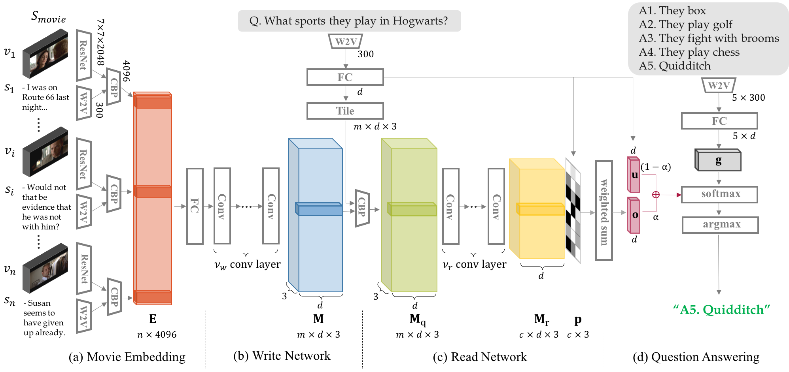
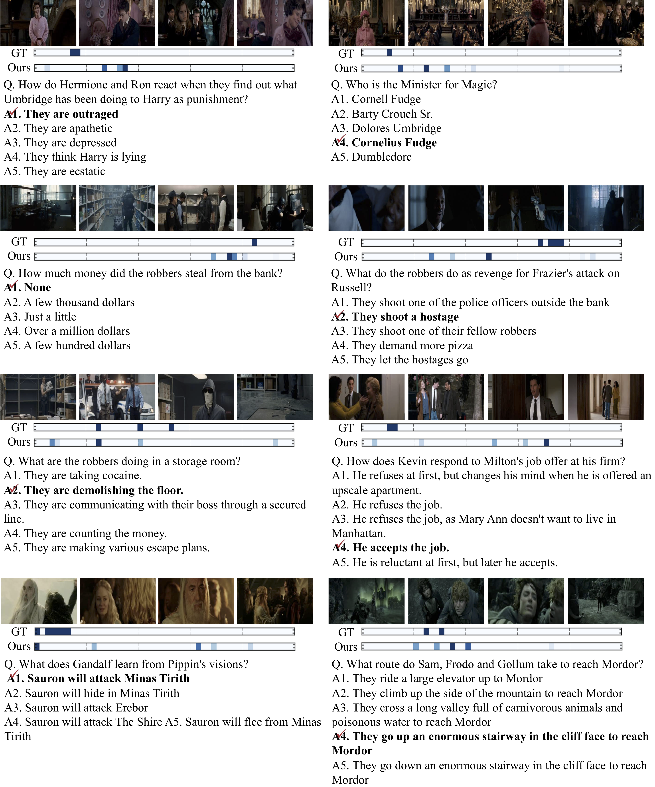
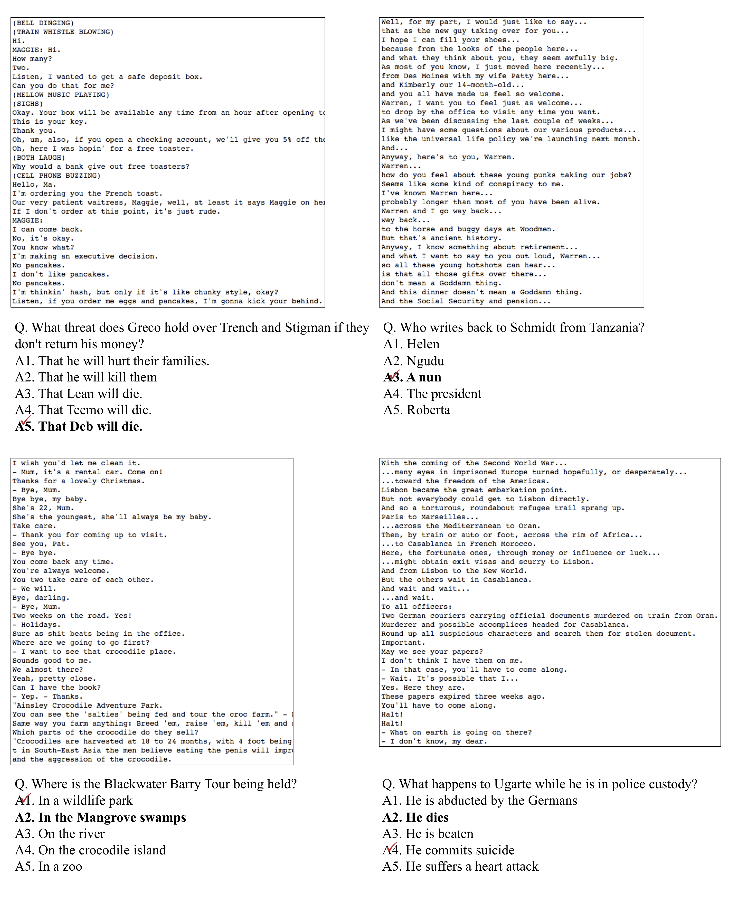
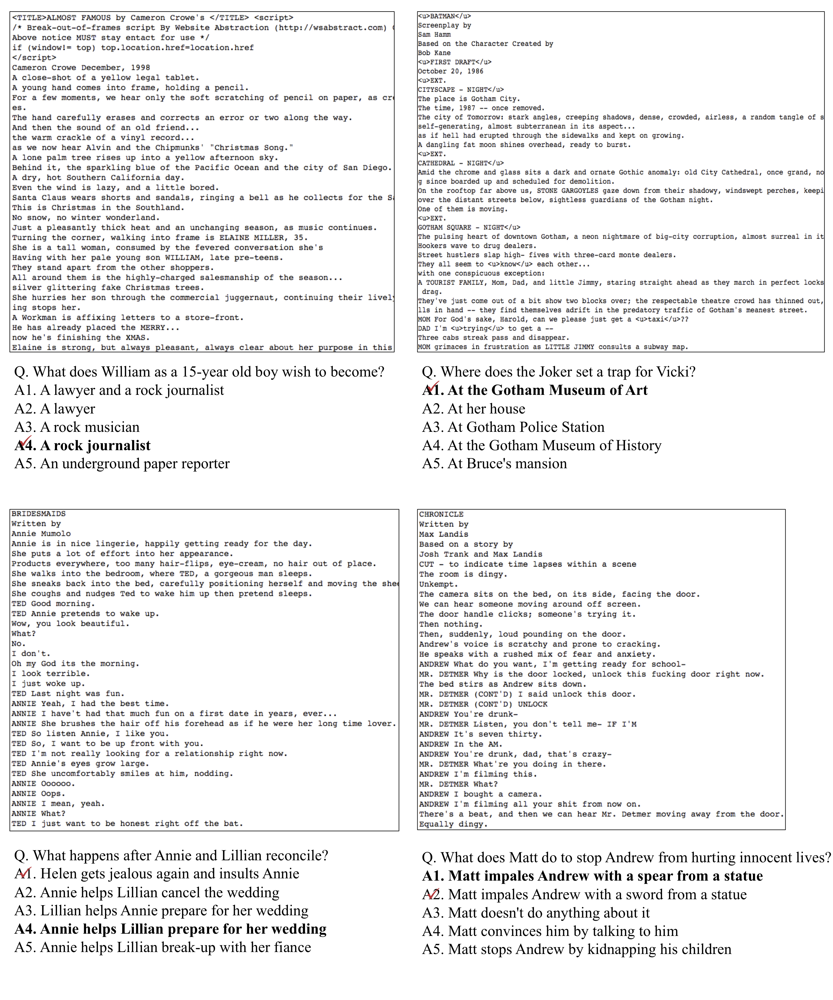
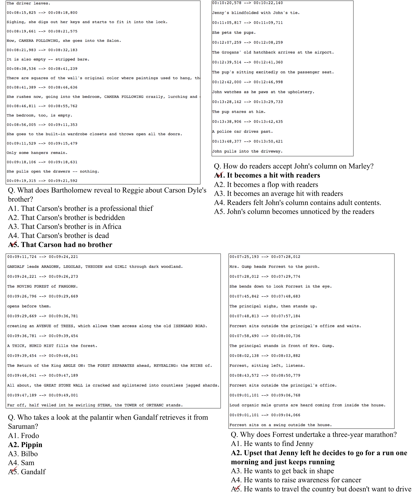

# RWMN
Paper: A Read-Write Memory Network for Movie Story Understanding, **[Seil Na](https://seilna.github.io/)**, Sangho Lee, Jisung Kim, [Gunhee Kim](http://www.cs.cmu.edu/~gunhee/). Accepted at ICCV 2017 [[arXiv]](https://arxiv.org/abs/1709.09345) 

```
@InProceedings{Na_2017_ICCV,
author = {Na, Seil and Lee, Sangho and Kim, Jisung and Kim, Gunhee},
title = {A Read-Write Memory Network for Movie Story Understanding},
booktitle = {The IEEE International Conference on Computer Vision (ICCV)},
month = {Oct},
year = {2017}
}
```



We propose a novel memory network model named Read-Write Memory Network (RWMN) to perform question and answering tasks for large-scale, multimodal movie story understanding. The key focus of our RWMN model is to design the read network and the write network that consist of multiple convolutional layers, which enable memory read and write operations to have high capacity and flexibility. For evaluation, we apply our model to all the six tasks of the [MovieQA benchmark](http://movieqa.cs.toronto.edu/home/), and achieve the best accuracies on several tasks, especially on the visual QA task.

## Training
```
usage: train.py [-h] [--sub_with_video_features [SUB_WITH_VIDEO_FEATURES]]
                [--nosub_with_video_features]
                [--save_threshold SAVE_THRESHOLD] [--max_steps MAX_STEPS]
                [--learning_rate_decay_examples LEARNING_RATE_DECAY_EXAMPLES]
                [--learning_rate_decay_rate LEARNING_RATE_DECAY_RATE]
                [--name NAME] [--video_features [VIDEO_FEATURES]]
                [--novideo_features] [--dim_rgb DIM_RGB] [--dim_sub DIM_SUB]
                [--init_lr INIT_LR]
                [--init_accumulator_value INIT_ACCUMULATOR_VALUE]
                [--bn_decay BN_DECAY] [--batch_size BATCH_SIZE]
                [--num_hop NUM_HOP] [--dim_text DIM_TEXT] [--dim_mcb DIM_MCB]
                [--dim_memory DIM_MEMORY] [--num_answer NUM_ANSWER]
                [--data_source DATA_SOURCE] [--summary_step SUMMARY_STEP]
                [--validation_step VALIDATION_STEP]
                [--checkpoint_step CHECKPOINT_STEP]
                [--full_validation_step FULL_VALIDATION_STEP]
                [--summary_dir SUMMARY_DIR] [--checkpoint_dir CHECKPOINT_DIR]
                [--summary_name SUMMARY_NAME] [--model MODEL]
                [--dropout DROPOUT] [--checkpoint_file CHECKPOINT_FILE]
                [--num_val_examples NUM_VAL_EXAMPLES]
                [--num_test_examples NUM_TEST_EXAMPLES]
                [--dim_context DIM_CONTEXT]
                [--num_memory_channel NUM_MEMORY_CHANNEL]
                [--kernel_height KERNEL_HEIGHT]
                [--dim_mcb_output DIM_MCB_OUTPUT]
                [--num_params_level NUM_PARAMS_LEVEL]
                [--early_stop EARLY_STOP] [--wconv_h WCONV_H]
                [--wconv_w WCONV_W] [--wstride_h WSTRIDE_H]
                [--wstride_w WSTRIDE_W] [--rconv_h RCONV_H]
                [--rconv_w RCONV_W] [--rstride_h RSTRIDE_H]
                [--rstride_w RSTRIDE_W] [--pretrain PRETRAIN] [--write WRITE]
                [--read READ] [--reg REG]
                [--checkpoint_threshold CHECKPOINT_THRESHOLD]
                [--init_acc INIT_ACC] [--sharp SHARP]

optional arguments:
  -h, --help            show this help message and exit
  --sub_with_video_features [SUB_WITH_VIDEO_FEATURES]
                        .
  --nosub_with_video_features
  --save_threshold SAVE_THRESHOLD
                        checkpoint save threshold
  --max_steps MAX_STEPS
                        max steps to train
  --learning_rate_decay_examples LEARNING_RATE_DECAY_EXAMPLES
                        step to decay learning rate
  --learning_rate_decay_rate LEARNING_RATE_DECAY_RATE
                        learning rate decay rate
  --name NAME           name of training model.
  --video_features [VIDEO_FEATURES]
                        Video+Sub or Text mode.
  --novideo_features
  --dim_rgb DIM_RGB     Inception: 1536, ResNet: 2048
  --dim_sub DIM_SUB     word2vec embedding dimension
  --init_lr INIT_LR     learning rate initializer.
  --init_accumulator_value INIT_ACCUMULATOR_VALUE
                        learning rate initializer.
  --bn_decay BN_DECAY   Batchnorm decay rate
  --batch_size BATCH_SIZE
                        mini-batch size.
  --num_hop NUM_HOP     number of hops.
  --dim_text DIM_TEXT   text feature dimension.
  --dim_mcb DIM_MCB     mcb feature dimension.
  --dim_memory DIM_MEMORY
                        memory dimension.
  --num_answer NUM_ANSWER
                        number of answer candidates.
  --data_source DATA_SOURCE
                        [video_sub, sub, dvs, script, plot]
  --summary_step SUMMARY_STEP
                        summery iteration step.
  --validation_step VALIDATION_STEP
                        validation iteration step.
  --checkpoint_step CHECKPOINT_STEP
                        checkpoint iteration step.
  --full_validation_step FULL_VALIDATION_STEP
                        full validation iteration step
  --summary_dir SUMMARY_DIR
                        path of summary data.
  --checkpoint_dir CHECKPOINT_DIR
                        path of checkpoint data.
  --summary_name SUMMARY_NAME
                        name of the summary
  --model MODEL         [stm, ltm]
  --dropout DROPOUT     keeping probability with dropout.
  --checkpoint_file CHECKPOINT_FILE
                        absolute path of checkpoint file
  --num_val_examples NUM_VAL_EXAMPLES
                        The number of validation QA examples.
  --num_test_examples NUM_TEST_EXAMPLES
                        The number of test QA examples.
  --dim_context DIM_CONTEXT
                        Dimension of context.
  --num_memory_channel NUM_MEMORY_CHANNEL
                        Number of memory channels.
  --kernel_height KERNEL_HEIGHT
                        conv kernel height.
  --dim_mcb_output DIM_MCB_OUTPUT
                        Dimension of MCB output.
  --num_params_level NUM_PARAMS_LEVEL
                        # of params level.
  --early_stop EARLY_STOP
                        Early stop threshold.
  --wconv_h WCONV_H     conv filter height of Write Network
  --wconv_w WCONV_W     conv filter width of Write Network
  --wstride_h WSTRIDE_H
                        stride height of Write Network
  --wstride_w WSTRIDE_W
                        stride width of Write Network
  --rconv_h RCONV_H     conv filter height of Write Network
  --rconv_w RCONV_W     conv filter width of Write Network
  --rstride_h RSTRIDE_H
                        stride height of Write Network
  --rstride_w RSTRIDE_W
                        stride width of Write Network
  --pretrain PRETRAIN   pretrained checkpoint file.
  --write WRITE         10-5-1/10-5-1 --> conv_h, stride_h, channel
  --read READ           5-3-3/5-3-3 --> conv_h, stride_h, channel
  --reg REG             Regularization strength
  --checkpoint_threshold CHECKPOINT_THRESHOLD
                        Checkpoint threshold
  --init_acc INIT_ACC   init acc
  --sharp SHARP         sharpening parameter.
```

## Video & Subtitle Features

```
$ chmod +x download.sh
$ ./download.sh
```

* It would be about size of 51G.
* Also, you should touch path for [Compact-Bilinear-Pooling](https://github.com/ronghanghu/tensorflow_compact_bilinear_pooling) at `model/ltm.py` like `sys.path.append("your/path/to/cbp")`

## Examples
### Video-based Answering 



## Text-based Answering





## Acknowledgement
We appreciate [Youngjae Yu](https://yj-yu.github.io/home/), Byeongchang Kim, Insu Jeon, [Yunseok Jang](https://yunseokjang.github.io/), Youngjin Kim, [Makarand Tapaswi](http://www.cs.toronto.edu/~makarand/) for helpful comments and discussions.

## Authors
[Seil Na](seilna.github.io), Sangho Lee, Jisung Kim, [Gunhee Kim](http://www.cs.cmu.edu/~gunhee/)

[Vision and Learning Lab](https://vision.snu.ac.kr) @ Computer Science and Engineering, Seoul National University, Seoul, Korea


## License
MIT license
